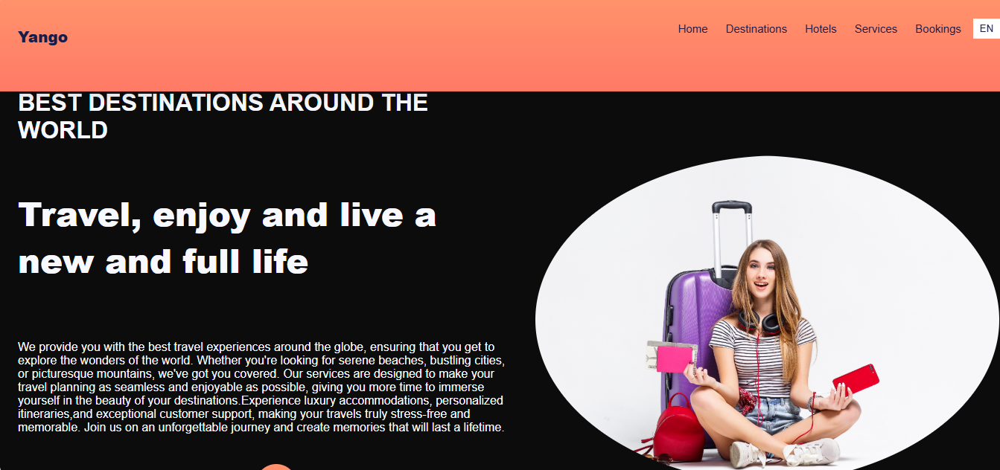
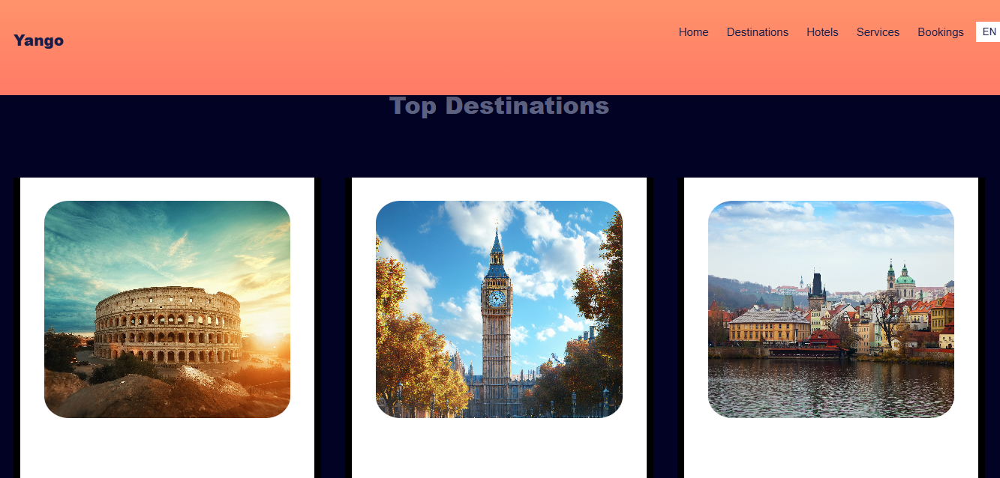
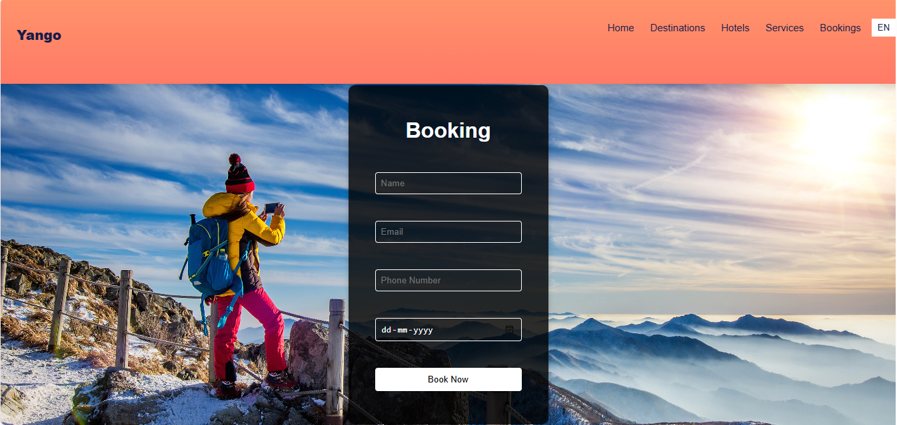

# 🌍 **Yango Travel Website** ✈️

A responsive travel website built with **React, HTML, CSS, and JavaScript**. It features interactive destination guides, booking functionalities, dynamic navigation, and subscription options. This project demonstrates front-end development skills and a focus on **UI/UX design**.

🔗 **Live Demo**: [Yango Travel Website](https://adarsh8086.github.io/Traveling/)

---

## 🚀 **Features**

- **Responsive Design**: Optimized for all devices — mobile, tablet, and desktop.  
- **Interactive Destination Guides**: Explore various destinations with detailed information.  
- **Booking Functionality**: Easily book travel plans (simulated functionality).  
- **Dynamic Navigation**: Smooth navigation and page transitions.  
- **Subscription Options**: Newsletter subscription feature to stay updated.  
- **Modern UI/UX**: Designed with user-friendly interfaces and smooth interactions.  

---

## 🛠️ **Technologies Used**

- **React**: Component-based architecture for dynamic UI.  
- **HTML5**: Structure and layout.  
- **CSS3**: Styling and responsive design.  
- **JavaScript (ES6)**: Interactivity and dynamic content.  

---

## 📥 **How to Run the Project Locally**

1. **Clone the Repository**:

   ```bash
   git clone https://github.com/adarsh8086/Traveling.git
   

## 🖼️ **Screenshots**

### 🏠 **Homepage**



### 🌍 **Destination Guide**




### ✈️ **Booking Page**




